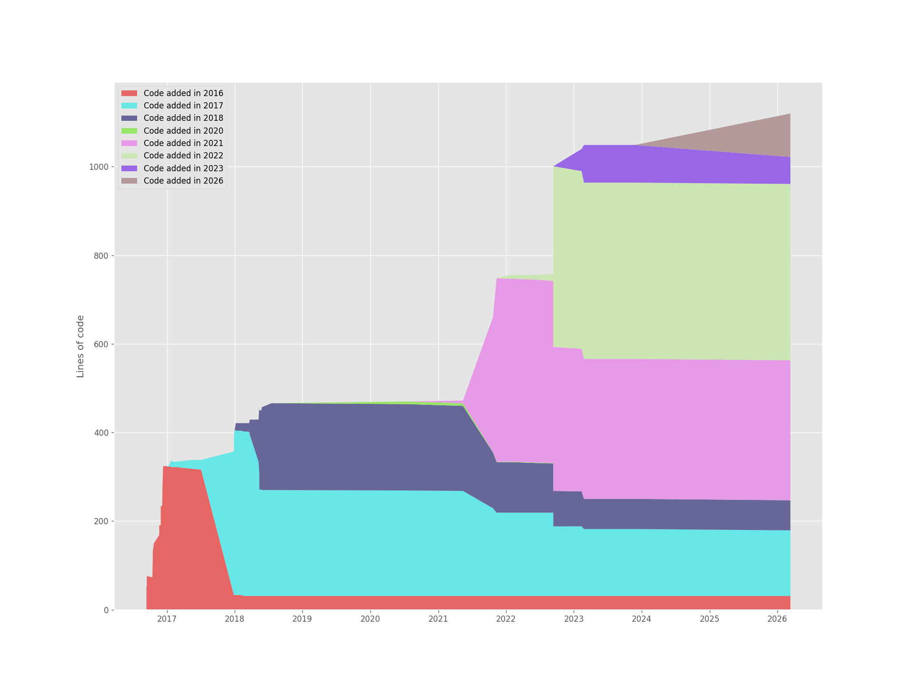
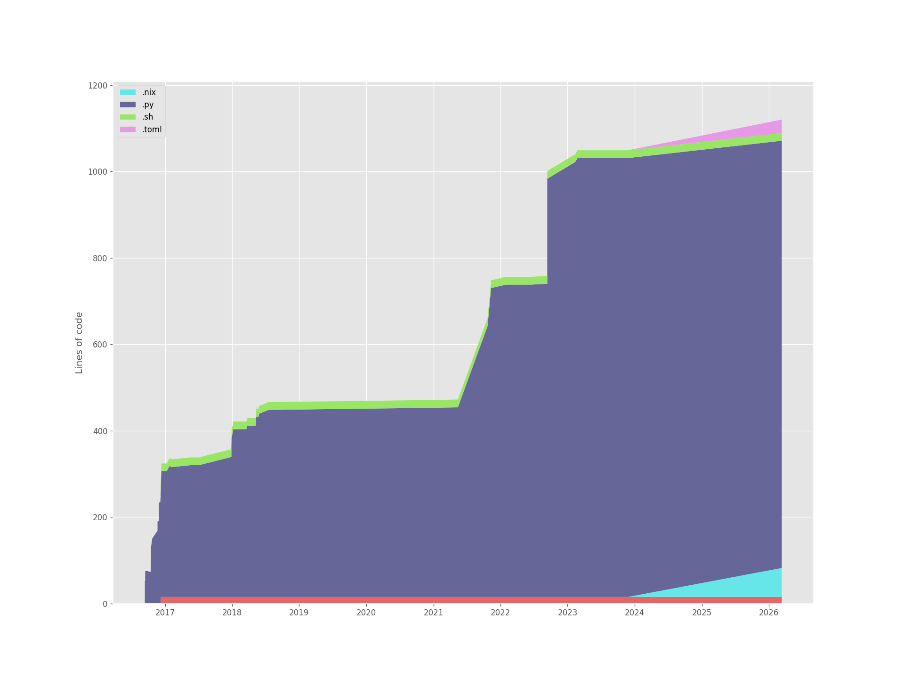
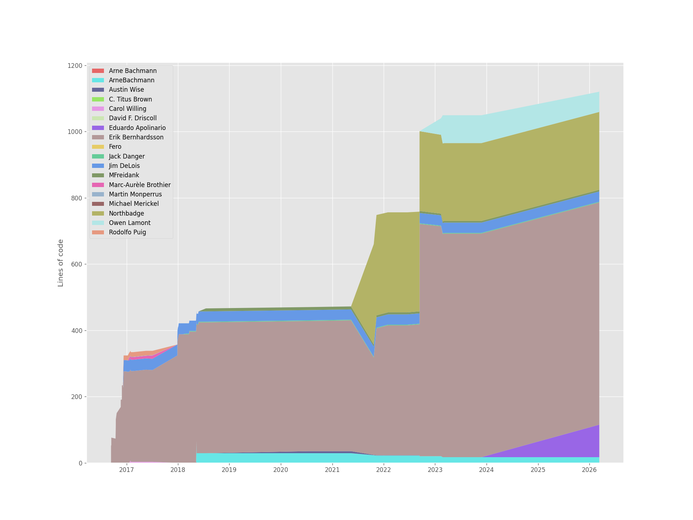
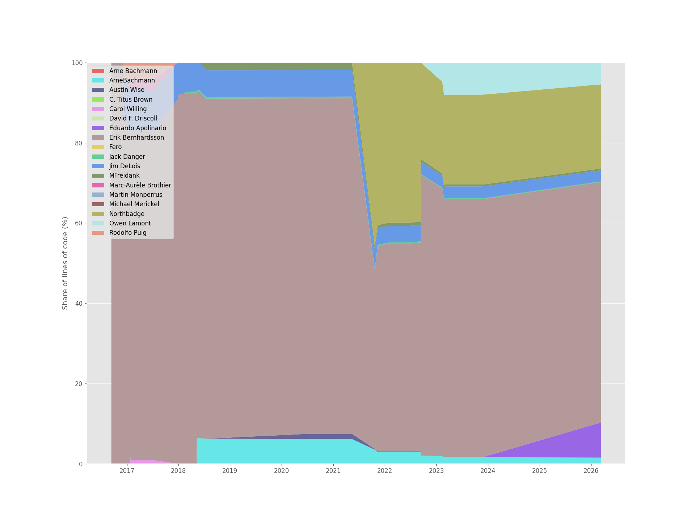
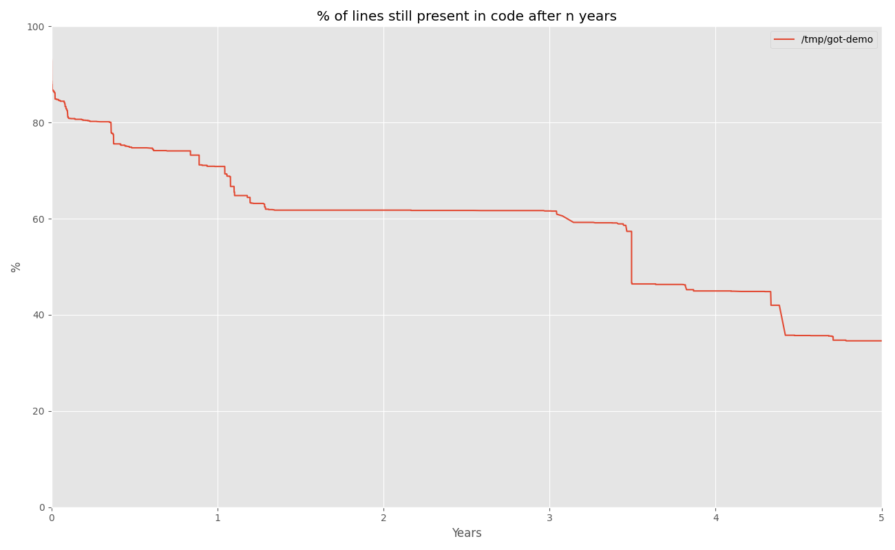
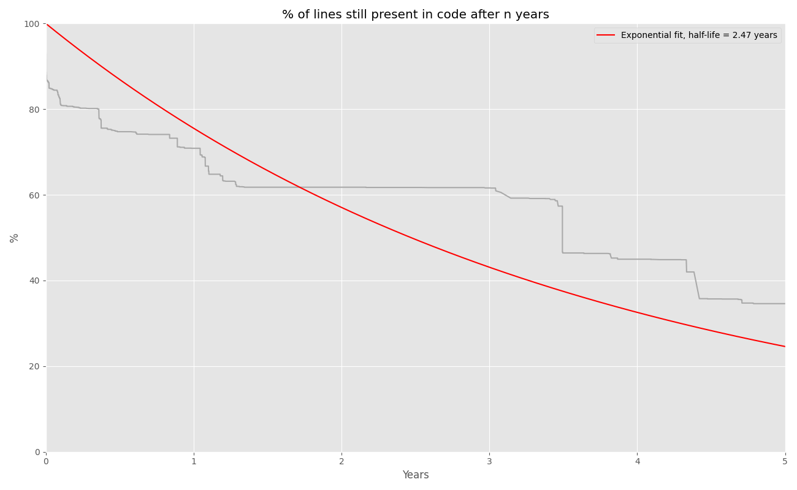

# Git of Theseus

> *If a ship's planks are replaced one by one over time, is it still the same ship?*

Git of Theseus analyzes the evolution of a Git repository over time, answering questions like: how much of the code written in 2018 still exists today? Which authors' code has the longest survival half-life? How has the codebase grown across different file types?

Here's an example running it on this very repository — code broken down by the year it was added:



## Installation

This is a fork of the original [git-of-theseus](https://github.com/erikbern/git-of-theseus) project. Install directly from this repository:

```shell
pip install git+https://github.com/eapolinario/git-of-theseus.git
```

Or clone and install with [uv](https://github.com/astral-sh/uv):

```shell
git clone https://github.com/eapolinario/git-of-theseus.git
cd git-of-theseus
uv sync
```

## Usage

### Step 1 — Analyze a repository

```shell
git-of-theseus-analyze <path-to-repo> --outdir <output-dir>
```

This writes several JSON files to `<output-dir>`:

| File | Contents |
|------|----------|
| `cohorts.json` | Lines of code grouped by the year they were added |
| `authors.json` | Lines of code grouped by author |
| `exts.json` | Lines of code grouped by file extension |
| `dirs.json` | Lines of code grouped by top-level directory |
| `survival.json` | Data for survival curve estimation |

Analysis can take a while on large repos. Run `git-of-theseus-analyze --help` for all options including `--interval`, `--branch`, `--ignore`, and `--only`.

#### Faster analysis with the Rust port (experimental)

A Rust reimplementation of the analyzer is being developed in this repository under `crates/got-core` and `crates/got-cli`. It uses [libgit2](https://libgit2.org/) directly and runs significantly faster than the Python version on large histories while writing JSON files in the exact same schema, so the existing Python plot scripts work unchanged.

Build and run:

```shell
cargo build --release
./target/release/git-of-theseus-analyze-rs <path-to-repo> --outdir <output-dir>

# Then use the existing Python plot scripts on the JSON output:
git-of-theseus-stack-plot <output-dir>/cohorts.json
```

Flags mirror `git-of-theseus-analyze`. Some Python-only features (mailmap rewriting via `git check-mailmap`, the `--opt` commit-graph flag, and interactive SIGINT pause/resume) are not yet implemented in the Rust port; the Python CLI remains the reference implementation while the migration is in progress.

### Step 2 — Generate plots

**Stack plot** (cohorts, authors, file extensions, or directories):

```shell
git-of-theseus-stack-plot <output-dir>/cohorts.json
git-of-theseus-stack-plot <output-dir>/authors.json
git-of-theseus-stack-plot <output-dir>/exts.json --outfile exts.png
```

**Survival plot** (percentage of lines still present after N years):

```shell
git-of-theseus-survival-plot <output-dir>/survival.json
git-of-theseus-survival-plot <output-dir>/survival.json --exp-fit
```

**Line plot** (normalized trends for authors or cohorts):

```shell
git-of-theseus-line-plot <output-dir>/authors.json --normalize
```

All commands accept `--help` for the full list of options.

## Sample Plots

The following plots were generated by running Git of Theseus on **its own repository**.

### Code by cohort (year added)

Lines of code broken down by the year they were first committed:


### Code by file extension

The codebase is almost entirely Python, with shell scripts and Nix/TOML files added in later years:



### Code by author

Contributions over time from each author:



### Author contributions (normalized)

The same data normalized to 100%:



### Survival of a line of code

What percentage of lines written at a given point in time are still present N years later, estimated using [Kaplan-Meier](https://en.wikipedia.org/wiki/Kaplan%E2%80%93Meier_estimator):



With an exponential decay fit:



## Analyzing Multiple Repositories

To compare survival curves across projects, analyze each repository separately and pass all `survival.json` files to the survival plot command:

```shell
git-of-theseus-analyze /path/to/repo-a --outdir repo-a-data
git-of-theseus-analyze /path/to/repo-b --outdir repo-b-data
git-of-theseus-survival-plot repo-a-data/survival.json repo-b-data/survival.json --exp-fit
```

## Working with Authors

If the same contributor appears under multiple names or email addresses, create a [`.mailmap`](https://git-scm.com/docs/gitmailmap) file in the root of the repository to deduplicate them.

To list unique author/email combinations:

**macOS / Linux**
```shell
git log --pretty=format:"%an %ae" | sort | uniq
```

**Windows PowerShell**
```powershell
git log --pretty=format:"%an %ae" | Sort-Object | Select-Object -Unique
```

## Troubleshooting

**`AttributeError: Unknown property labels`** — upgrade matplotlib:
```shell
pip install matplotlib --upgrade
```

## Related Projects

[Hercules](https://github.com/src-d/hercules) by [Markovtsev Vadim](https://twitter.com/tmarkhor) performs a similar analysis and claims to be 20%–6x faster. There's a good [blog post](https://web.archive.org/web/20180918135417/https://blog.sourced.tech/post/hercules.v4/) covering the complexity involved in analyzing Git history.
