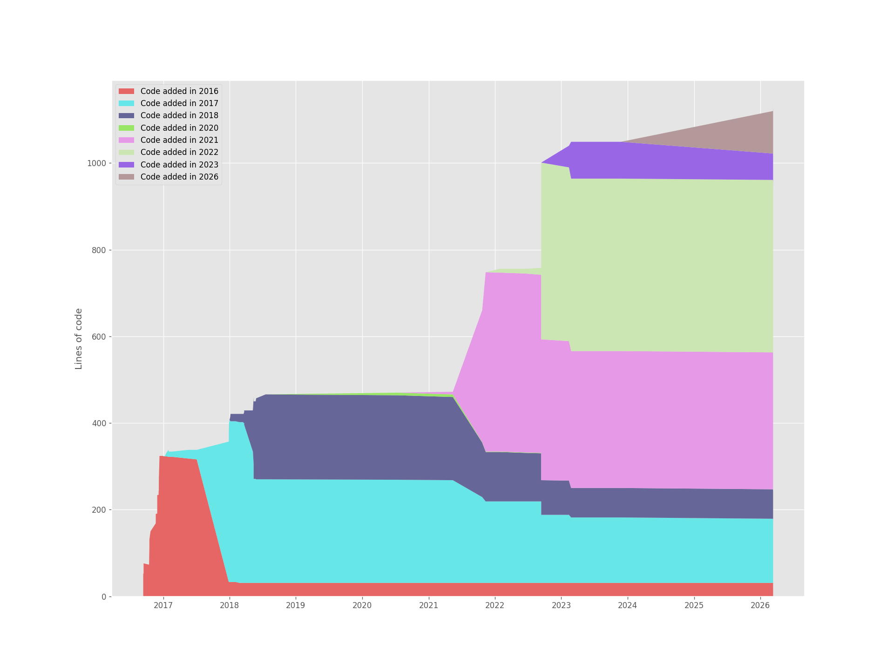
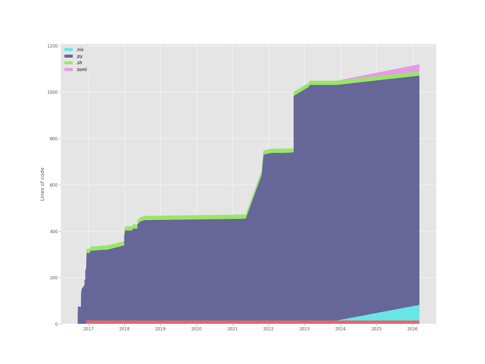
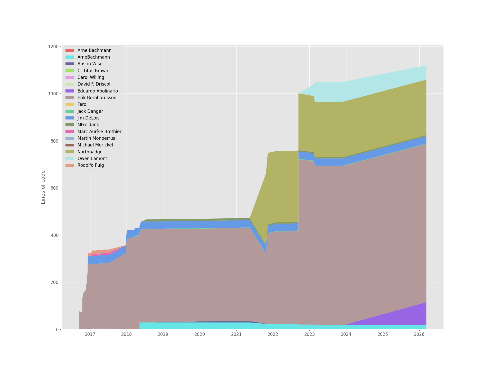
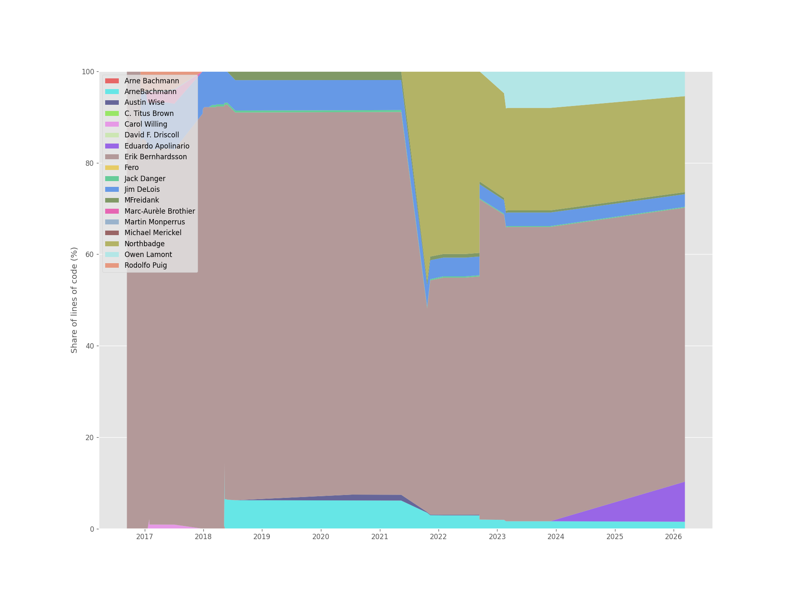
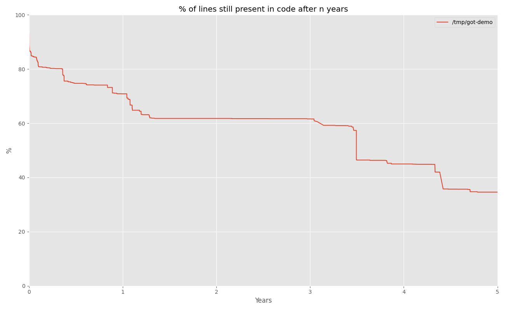
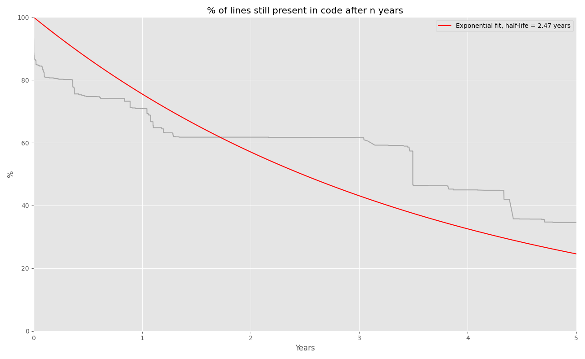

# Git of Theseus

> *If a ship's planks are replaced one by one over time, is it still the same ship?*

Git of Theseus analyzes the evolution of a Git repository over time, answering questions like: how much of the code written in 2018 still exists today? Which authors' code has the longest survival half-life? How has the codebase grown across different file types?

Here's an example running it on this very repository — code broken down by the year it was added:



## Installation

Clone the repository and build with Cargo:

```shell
git clone https://github.com/eapolinario/git-of-theseus.git
cd git-of-theseus
cargo build --release
```

Executables will be in `target/release/`. Add that directory to your `$PATH`, or run them directly:

```shell
./target/release/git-of-theseus-analyze --help
```

## Usage

### Step 1 — Analyze a repository

```shell
git-of-theseus-analyze <path-to-repo> --outdir <output-dir>
```

This writes several JSON files to `<output-dir>`:

| File | Contents |
|------|----------|
| `cohorts.json` | Lines of code grouped by the year they were added |
| `authors.json` | Lines of code grouped by author |
| `exts.json` | Lines of code grouped by file extension |
| `dirs.json` | Lines of code grouped by top-level directory |
| `domains.json` | Lines of code grouped by author email domain |
| `survival.json` | Data for survival curve estimation |

Analysis can take a while on large repos. Run `git-of-theseus-analyze --help` for all options including `--interval`, `--branch`, `--ignore`, and `--only`. For repositories with long histories, opt in to write a commit graph before analysis:

```shell
git-of-theseus-analyze --opt <path-to-repo> --outdir <output-dir>
```

This runs `git commit-graph write --reachable` for each requested repository. It requires Git 2.18+ and changes only repository commit-graph metadata; it can make history traversal about 1.1–2x faster, though end-to-end analysis gains are usually smaller because blame dominates runtime.

### Analyzing multiple repositories

Pass two or more repository paths to analyze them in one run:

```shell
git-of-theseus-analyze repo-one repo-two --outdir got
```

Each repository writes the normal JSON files to a named subdirectory:
`got/repo-one/cohorts.json`, `got/repo-two/cohorts.json`, and so on. If two
repositories have the same directory name, a numeric suffix is added.

### Plotting

The Rust implementation includes the full pipeline — analyze + line/stack/survival plots. Line, stack, and survival plots accept multiple input files. Line and stack plots align repository timelines, carry values forward between samples, and prefix labels with the repository directory name:

```shell
git-of-theseus-line-plot got/repo-one/authors.json got/repo-two/authors.json
git-of-theseus-stack-plot got/repo-one/cohorts.json got/repo-two/cohorts.json
git-of-theseus-survival-plot got/repo-one/survival.json got/repo-two/survival.json
```

Build and run end-to-end:

```shell
cargo build --release
OUT=got-rs
./target/release/git-of-theseus-analyze <path-to-repo> --outdir $OUT
./target/release/git-of-theseus-stack-plot $OUT/cohorts.json --outfile cohorts.png
./target/release/git-of-theseus-line-plot   $OUT/authors.json --normalize --outfile authors.png
./target/release/git-of-theseus-survival-plot $OUT/survival.json --exp-fit --outfile survival.png
```

Analyzing multiple repositories and overlaying their plots works the same way:

```shell
./target/release/git-of-theseus-analyze repo-one repo-two --outdir got-rs
./target/release/git-of-theseus-line-plot got-rs/repo-one/authors.json got-rs/repo-two/authors.json --outfile authors.svg
./target/release/git-of-theseus-stack-plot got-rs/repo-one/cohorts.json got-rs/repo-two/cohorts.json --outfile cohorts.svg
./target/release/git-of-theseus-survival-plot got-rs/repo-one/survival.json got-rs/repo-two/survival.json --outfile survival.svg
```

`git-of-theseus-analyze` additionally supports `--merge`: instead of one output subdirectory per repository, it
combines every repository into a single set of output files written
directly to `--outdir`. Series for a label shared across repositories
(the same author, extension, cohort, directory, or domain) are aligned
onto a shared timeline and summed, so the result reads as if all the
repositories were one project:

```shell
./target/release/git-of-theseus-analyze repo-one repo-two --outdir got-rs-merged --merge
./target/release/git-of-theseus-stack-plot got-rs-merged/cohorts.json --outfile cohorts-merged.png
```

All Rust plot binaries support both PNG and SVG output (chosen by file extension)
and accept the existing plot flags (`--outfile`, `--max-n`, `--normalize`,
`--exp-fit`, `--years`). `--display` is currently a no-op. The Rust
line and stack plot commands support the same optional `--events` manifest.

The Rust CLI is now the only shipped implementation; the Python package has
been removed. A handful of features from the former Python CLI are not yet
implemented in Rust and are documented below as a breaking change rather than
a gap versus a still-available reference implementation: mailmap rewriting
via `git check-mailmap` and interactive SIGINT pause/resume. Invocations that
relied on those flags will now fail; see the deferred-features checklist below
for tracking. `--merge` is the
reverse case: a Rust-only addition that had no Python equivalent.

##### Rust port — TODO

The Rust port is being delivered incrementally. Tracked work:

**Part 1 — got-core / got-cli scaffold (this PR)**
- [x] Cargo workspace with `got-core` library and `got-cli` (`git-of-theseus-analyze`) binary
- [x] Commit walking, interval-based commit sampling, tree enumeration, `--only` / `--ignore` / default-filetype filtering
- [x] Default-filetype list snapshot generated from pygments via `scripts/gen_filetypes.py`
- [x] Parallel blame via rayon with per-thread `git2::Repository`
- [x] Fast diff that skips blame on unchanged blobs
- [x] JSON output matching `cohorts.json` / `exts.json` / `authors.json` / `dirs.json` / `domains.json` / `survival.json`, consumable by the existing Python plot scripts
- [x] Multi-repository analysis (`git-of-theseus-analyze repo-a repo-b ...`) and multi-input line/stack/survival plots, matching the Python CLI
- [x] `--merge`: combine multiple repositories into a single, summed set of output files (Rust-only; no Python equivalent yet)
- [x] Unit + end-to-end integration tests; `fmt --check`, `clippy -D warnings`, build/test in CI; CI cross-checks Rust JSON via the Python plot scripts

**Part 1.x — fill in deferred Python features**
- [ ] `mailmap` author/email rewriting (the Python `get_mailmap_author_name_email` helper)
- [x] `--opt` flag: write `git commit-graph` for faster history walking on large repos
- [ ] Interactive SIGINT pause / process-count adjustment (the `handler` function in the Python CLI)
- [ ] Warn-and-fall-back behaviour exactly matching Python when `--branch` does not exist (currently emits a one-line warning to stderr; Python uses `warnings.warn` and special-cases detached HEAD)
- [ ] Investigate cohort-bucket distribution differences vs Python (libgit2 vs `git blame` rename detection — totals already match exactly)

**Part 2 — `got-wasm` web target**
- [ ] New `crates/got-wasm` crate exposing `analyze` to JS via `wasm-bindgen`
- [ ] `GitBackend` trait abstraction in `got-core` so WASM can plug in an `isomorphic-git`-backed implementation instead of `git2`
- [ ] Browser glue: clone via `isomorphic-git` (CORS proxy, see decision log) into an in-memory FS, then drive `got-wasm`
- [ ] Run blame on a Web Worker so the UI stays responsive
- [ ] Optional: GitHub GraphQL `blame` API as an alternate backend (no proxy, rate-limited)

**Part 3 — Rust ports of plot CLIs**
- [x] `git-of-theseus-line-plot`, `git-of-theseus-stack-plot`, `git-of-theseus-survival-plot` binaries built on [`plotters`](https://crates.io/crates/plotters), with PNG + SVG output and exp-fit parity to scipy's Nelder-Mead (verified to 6 decimals on a real `survival.json`)
- [ ] Switch `plotters` to `default-features = false` + `ab_glyph` + a bundled font (e.g. DejaVuSans) so the Rust CLI no longer requires system `fontconfig`/`freetype` (and drop those deps from `flake.nix`)
- [ ] Wire `--display` to actually open the rendered file (e.g. via the `open` crate / `xdg-open`); currently a no-op that prints a hint
- [ ] Visual-regression snapshot tests for the rendered PNGs (golden-file diff with a small tolerance) once the rendering style stabilizes
- [ ] Investigate visual parity with matplotlib's `ggplot` style: tick density, axis label font size, legend placement
- [x] Deprecate and remove the Python plot scripts now that Rust parity is reached

**Part 4 — Cutover**
- [x] Rename `git-of-theseus-analyze-rs` → `git-of-theseus-analyze` now that the Rust CLI ships under the original command names
- [ ] Ship pre-built binaries (release workflow + GitHub Releases)
- [x] Update `Dockerfile`, `flake.nix`, `Justfile`, and the existing CI matrix accordingly
- [x] Remove the Python `analyze.py` (and the rest of the Python package)


### Step 2 — Generate plots

**Stack plot** (cohorts, authors, file extensions, or directories):

```shell
git-of-theseus-stack-plot <output-dir>/cohorts.json
git-of-theseus-stack-plot <output-dir>/authors.json
git-of-theseus-stack-plot <output-dir>/exts.json --outfile exts.png
```

**Survival plot** (percentage of lines still present after N years):

```shell
git-of-theseus-survival-plot <output-dir>/survival.json
git-of-theseus-survival-plot <output-dir>/survival.json --exp-fit
```

**Line plot** (normalized trends for authors or cohorts):

```shell
git-of-theseus-line-plot <output-dir>/authors.json --normalize
```

### Add event markers

Line and stack plots use calendar-time x axes. Add external event markers
with a YAML manifest:

```shell
git-of-theseus-line-plot <output-dir>/authors.json \
  --events examples/events.yaml --outfile authors-with-events.png
git-of-theseus-stack-plot <output-dir>/cohorts.json \
  --events examples/events.yaml --outfile cohorts-with-events.png
git-of-theseus-line-plot <output-dir>/authors.json \
  --events examples/events.yaml --outfile authors-with-events.svg
git-of-theseus-stack-plot <output-dir>/cohorts.json \
  --events examples/events.yaml --outfile cohorts-with-events.svg
```

Each marker has a number above the chart. The event key below the chart
shows its date, provider, event type, label, and scope. Events on the same
date keep separate numbers. Nearby numbers use separate rows to prevent
overlap. Long key entries wrap, and the output height increases as needed.
The data area and axis limits do not change.

SVG files also have tooltips. Open the `.svg` file directly in a web
browser. Hold the pointer over an event line, its number, or its key entry
to see the full label, date, provider, model, event type, scope, source,
and notes. Notes are omitted when empty. Sources are plain text; the plot
does not open them or run scripts. Events on the same date share a line
position, so use their separate numbers or key entries to inspect each one.
PNG files keep the same static chart and key.

To use a local manifest in PowerShell:

```powershell
cargo run -p got-cli --bin git-of-theseus-stack-plot -- `
  .\got\cohorts.json --events "C:\path\to\model-releases.yaml" `
  --outfile .\cohorts-with-events.svg
```

The manifest has `schema_version: 1` and an `events` list. Each event requires
`date`, `provider`, `model`, `event`, `scope`, `label`, and `source`.
Dates support ISO `YYYY-MM-DD` values and ISO timestamps; timezone-aware
timestamps are converted to UTC before their calendar date is used. Valid
event values are `announced`, `available`, `pilot`, `default`, and `retired`.
Partial dates such as `2026-09` are rejected. Quote dates to keep them
portable between YAML tools. The optional `notes` field must be a string.
Extra fields, such as `window`, `coverage`, `limitations`, and per-event
evidence, are allowed. The `window` field is metadata; it does not crop the
plot. An omitted schema version defaults to 1.

`provider` controls a stable line color.
`event` controls the line style. The key also states the provider and
event type, so it does not rely on color alone. Events outside the plot
range are ignored and do not expand the axis. An empty manifest, or one
with no events in range, leaves the plot unchanged. Invalid manifests
produce an error before the output file is written.

Event markers describe external dates only. `announced` and `available` do not
mean that code used the model, and the chart makes no causal claim. Shaded
intervals are not inferred from overlapping releases. The survival plot is
not calendar-time data: its x axis is elapsed code age in years, so
`--events` is rejected by both survival plot commands. The tools read the
manifest locally. They do not fetch or verify the sources in it.

Rust callers can set `events: Some(path)` in `LinePlotOptions` or
`StackPlotOptions`. Omit `events` to keep the normal plot behavior.

Shared fixtures in `tests/fixtures` cover dates, same-day events, all event
types, and out-of-range events. Run the tests with
`cargo test --workspace --locked`.

All commands accept `--help` for the full list of options.

## Sample Plots

The following plots were generated by running Git of Theseus on **its own repository**.

### Code by cohort (year added)

Lines of code broken down by the year they were first committed:


### Code by file extension

The codebase is almost entirely Python, with shell scripts and Nix/TOML files added in later years:



### Code by author

Contributions over time from each author:



### Author contributions (normalized)

The same data normalized to 100%:



### Survival of a line of code

What percentage of lines written at a given point in time are still present N years later, estimated using [Kaplan-Meier](https://en.wikipedia.org/wiki/Kaplan%E2%80%93Meier_estimator):



With an exponential decay fit:



## Analyzing Multiple Repositories

See [Analyzing multiple repositories](#analyzing-multiple-repositories) in
Step 1 above for how to analyze several repositories in one run (or
separately) and feed the results into any plot command — line, stack, or
survival:

```shell
git-of-theseus-analyze /path/to/repo-a --outdir repo-a-data
git-of-theseus-analyze /path/to/repo-b --outdir repo-b-data
git-of-theseus-survival-plot repo-a-data/survival.json repo-b-data/survival.json --exp-fit
```

## Working with Authors

If the same contributor appears under multiple names or email addresses, create a [`.mailmap`](https://git-scm.com/docs/gitmailmap) file in the root of the repository to deduplicate them.

To list unique author/email combinations:

**macOS / Linux**
```shell
git log --pretty=format:"%an %ae" | sort | uniq
```

**Windows PowerShell**
```powershell
git log --pretty=format:"%an %ae" | Sort-Object | Select-Object -Unique
```

## Related Projects

[Hercules](https://github.com/src-d/hercules) by [Markovtsev Vadim](https://twitter.com/tmarkhor) performs a similar analysis and claims to be 20%–6x faster. There's a good [blog post](https://web.archive.org/web/20180918135417/https://blog.sourced.tech/post/hercules.v4/) covering the complexity involved in analyzing Git history.
